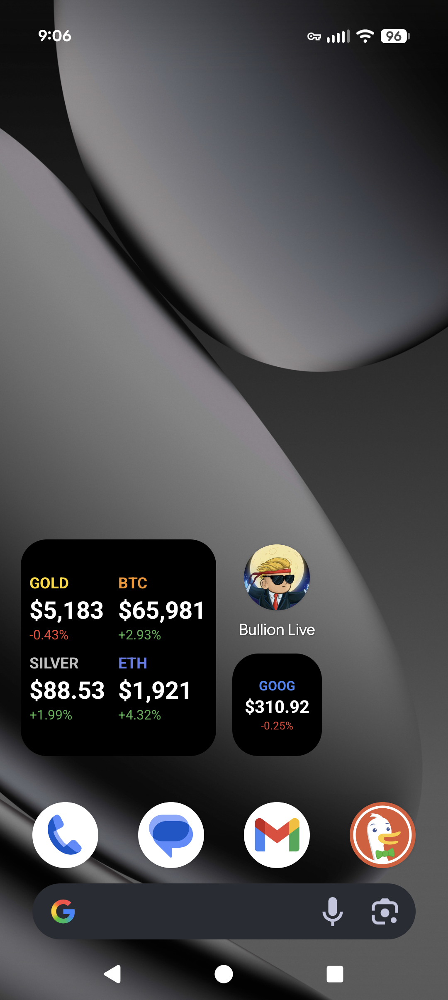
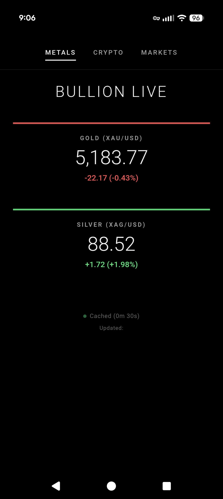
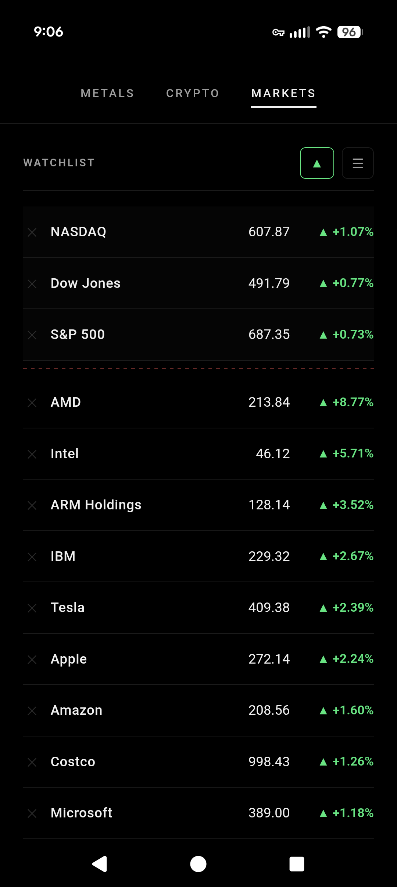
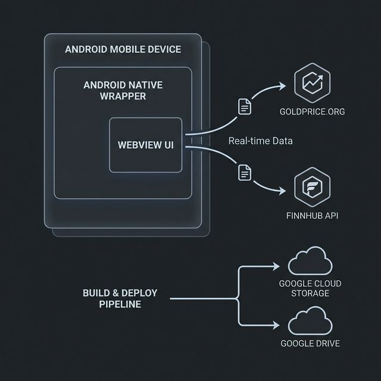

# Bullion Live


A real-time financial asset tracker for Android delivering live prices for precious metals, cryptocurrencies, and equities. Built as a hybrid WebView app with a native Kotlin data layer — featuring three-tier caching, centralized rate limiting, and home screen widgets.

<p align="center">
  
  &nbsp;&nbsp;
  
  &nbsp;&nbsp;
  
</p>
<p align="center">
  <em>Home screen widgets&nbsp;&nbsp;·&nbsp;&nbsp;Metals tab&nbsp;&nbsp;·&nbsp;&nbsp;Markets watchlist</em>
</p>

---

## Highlights

- **Three-tier cache** (SharedPreferences → in-memory Kotlin → in-memory JS) with 1-min fresh / 15-min stale TTLs
- **Centralized rate limiter** respecting Finnhub's 60/min free-tier budget with request deduplication, per-second burst caps, and HTTP 429 backoff
- **Two home screen widgets** (2x2 metals + 1x1 stock) sharing the same persistent cache — always in sync with the main app
- **60-second background polling** via AlarmManager with 30-min system fallback for battery-optimized devices
- **50+ JavaScript tests** (Jest) and **20+ Kotlin unit tests** (JUnit) covering formatters, cache logic, API parsing, and UI components
- **Zero third-party HTTP dependencies** — built on `HttpURLConnection` for a minimal APK footprint

---

## Quick Start

### Prerequisites

- Android SDK (compileSdk 35, minSdk 26)
- JDK 21
- Gradle 8.6+
- Free [Finnhub](https://finnhub.io/) API key

### Setup

1. Clone the repo
2. Create `android/local.properties`:
   ```properties
   sdk.dir=/path/to/your/Android/Sdk
   FINNHUB_API_KEY=your_finnhub_api_key_here
   ```
   > `local.properties` is git-ignored. Never commit API keys. The build script injects the key at compile time via `BuildConfig`.

3. Build:
   ```bash
   cd android && ./gradlew assembleDebug
   ```
   APK output: `android/app/build/outputs/apk/debug/app-debug.apk`

---

## Architecture

### How It Works

The app is a Kotlin Android shell wrapping a single-page HTML/JS/CSS app in a WebView. Native Kotlin handles background data fetching, persistent caching, home screen widgets, and rate limiting. The WebView handles all UI rendering.



```
┌─────────────────────────────────────────────────────────┐
│  Android (Kotlin)                                       │
│                                                         │
│  FetchService ──→ ApiRequestQueue ──→ PersistentCacheMgr│
│  (60s alarm)      (rate limiter)      (SharedPrefs)     │
│                                           │             │
│                                      broadcast          │
│                                       ┌───┴────┐        │
│                                       ▼        ▼        │
│                                   Widgets  MainActivity │
│                                             ┌────────┐  │
│                              CacheBridge ──→│WebView │  │
│                              (JS ↔ Kotlin)  └────────┘  │
└─────────────────────────────────────────────────────────┘
│                        │                        │
▼                        ▼                        ▼
GoldPrice.org       Finnhub API          User Watchlist
(no auth)         (API key in            (localStorage)
                   BuildConfig)
```

### Key Components

| File | Purpose |
|------|---------|
| `index.html` / `index.js` | WebView UI: 3 tabs (Metals, Crypto, Markets), dark theme |
| `MainActivity.kt` | WebView host, CacheBridge (JS-Kotlin), widget click intent handling |
| `FetchService.kt` | Background job (60s interval) fetching all data sources |
| `PersistentCacheManager.kt` | SharedPreferences cache, broadcasts updates on save |
| `ApiRequestQueue.kt` | Centralized Finnhub rate limiter (60/min, 30/sec) |
| `GoldPriceApi.kt` | Metals price client (GoldPrice.org, no auth required) |
| `FinnhubApi.kt` | Crypto + stock client (Finnhub, API key required) |
| `MetalsWidgetProvider.kt` | 2x2 home screen widget (Gold, Silver, BTC, ETH) |
| `SingleStockWidgetProvider.kt` | 1x1 home screen widget (GOOG) |
| `AppConfig.kt` | All constants: endpoints, timeouts, cache TTLs, rate limits |

### Project Structure

```
bullion-live/
├── index.html                     # Web app HTML + inline CSS
├── index.js                       # Web app logic (~975 lines, IIFE)
├── android/
│   ├── app/
│   │   ├── build.gradle.kts       # Build config, version, dependencies
│   │   └── src/
│   │       ├── main/
│   │       │   ├── assets/        # Copies of index.html + index.js
│   │       │   ├── java/com/bullionlive/
│   │       │   │   ├── MainActivity.kt
│   │       │   │   ├── FetchService.kt
│   │       │   │   ├── data/      # API clients, cache, rate limiter, config
│   │       │   │   └── widget/    # Home screen widget providers
│   │       │   └── res/           # Layouts, widget XML configs
│   │       └── test/              # Kotlin unit tests (JUnit)
│   └── local.properties           # API keys (git-ignored)
├── tests/                         # Jest test suite for WebView JS logic
│   ├── unit/                      # Pure logic: formatters, cache
│   ├── ui/                        # DOM component behavior
│   ├── pages/                     # Page-specific logic (ticker management)
│   ├── navigation/                # Tab switching, swipe gestures
│   └── __fixtures__/              # Test data (watchlist defaults)
└── docs/                          # Architecture diagram + screenshots
```

---

## Design Decisions

### Why a WebView hybrid instead of Jetpack Compose?

The UI is a price dashboard — styled cards and a scrollable list. HTML/CSS delivers this faster than Compose, with zero recompilation when tweaking layout. The native Kotlin layer handles everything that *needs* to be native: background services, widgets, persistent storage, and rate limiting. This separation keeps the WebView stateless and the Kotlin layer UI-free.

### Why three cache tiers?

A single cache creates a bottleneck. The JS in-memory tier avoids bridge calls on rapid tab switches. The Kotlin in-memory tier avoids SharedPreferences I/O during the same process lifecycle. The persistent tier survives process death and shares data between the WebView and home screen widgets. Each tier has the same 1-minute TTL, so staleness is consistent regardless of which layer serves the read.

### Why 15-minute stale max?

Financial data has a short shelf life. A 2-hour-old gold price is actively misleading. 15 minutes is long enough to survive a brief network outage or Finnhub rate-limit cooldown, but short enough that displayed prices remain actionable. Beyond 15 minutes, the app shows an error state rather than risk user decisions based on stale data.

### Why no third-party HTTP client?

`HttpURLConnection` handles everything this app needs — simple GET requests with JSON responses. Adding OkHttp or Retrofit would increase APK size and dependency surface for zero functional benefit. The `ApiRequestQueue` already centralizes retry logic, rate limiting, and error handling.

### Why centralized rate limiting in ApiRequestQueue?

Three independent callers hit Finnhub: the WebView (user-facing refreshes), FetchService (background polling), and widgets (on-demand updates). Without centralization, each caller would need its own rate budget, and concurrent access would still risk 429s. A single queue with per-minute and per-second caps, plus 5-second request deduplication, keeps utilization under 50% of the free-tier budget.

---

## Caching Strategy

Three-tier cache system designed for financial data freshness.

### Cache Tiers

| Tier | Storage | TTL | Purpose |
|------|---------|-----|---------|
| **Persistent** | SharedPreferences (`bullion_price_cache`) | Fresh: 1 min, Stale: 15 min | Survives process death. Shared by widgets + WebView |
| **In-memory Kotlin** | Volatile companion objects | 1 min | Fast path within same process |
| **In-memory JS** | `priceCache` object | 1 min | WebView fallback when native bridge unavailable |

### Data Flow

1. **Read**: JS calls `window.BullionCache.getCachedMetals()` -> CacheBridge reads PersistentCacheManager -> returns JSON
2. **Write**: JS fetches API -> saves via `window.BullionCache.saveMetals(json)` -> PersistentCacheManager writes to SharedPreferences -> broadcasts `CACHE_UPDATED` -> widgets refresh
3. **Fallback**: Cache < 1 min = skip API. Cache 1-15 min + API fails = use stale. Cache > 15 min = must fetch or fail.

---

## API Management & Rate Limiting

### Data Sources

| API | Data | Auth | Rate Limit |
|-----|------|------|------------|
| [GoldPrice.org](https://data-asg.goldprice.org/dbXRates/USD) | Gold, Silver spot prices | None | Unrestricted |
| [Finnhub](https://finnhub.io/api/v1/quote) | Crypto (BTC, ETH), Stocks | API key (query param) | 60/min, 30/sec (free tier) |

### Finnhub Rate Limit Budget

The `ApiRequestQueue` enforces rate limits across all callers (WebView, widgets, FetchService):

```
Budget: 60 calls/min (Finnhub free tier)

Per FetchService cycle (every 60s):
  2 crypto calls   (BTCUSDT, ETHUSDT)
  3 index calls    (SPY, DIA, QQQ)
  21 watchlist calls
  ─────────────────
  26 calls/cycle = 43% utilization

WebView fetches are cache-deduped (same SharedPreferences),
so effective rate stays under 50% with ~30 calls/min buffer.
```

### Rate Limit Protections

| Protection | How |
|------------|-----|
| **Per-minute cap** | Queue rejects requests beyond 60/min |
| **Per-second cap** | Queue rejects bursts beyond 30/sec |
| **Request deduplication** | Same request key within 5s is rejected |
| **HTTP 429 backoff** | 1-minute global cooldown; all requests use stale cache |
| **Stock fetch stagger** | 500ms between individual stock fetches to prevent bursts |
| **Exponential retry** | 500ms initial, 1.5x multiplier, 5 max retries on failure |

### WebView Fetch Intervals

| Tab | Interval | Rationale |
|-----|----------|-----------|
| Metals | 15s | GoldPrice.org, no rate limit |
| Crypto | 30s | Finnhub, cache-deduped with native |
| Markets | 60s | Matches cache TTL; 24 symbols per fetch |

---

## Widget Architecture

Two home screen widgets share the same `PersistentCacheManager` as the WebView, so all components always show identical data.

| Widget | Size | Shows | Click Action |
|--------|------|-------|-------------|
| Metals Widget | 2x2 | Gold, Silver, BTC, ETH | Opens corresponding tab (metals or crypto) |
| GOOG Widget | 1x1 | GOOG stock price | Opens Markets tab |

### Update Flow

```
FetchService (60s alarm)
  -> fetches all data via API clients
  -> saves to PersistentCacheManager
  -> broadcasts CACHE_UPDATED
       -> MainActivity receives -> pushes to WebView
       -> FetchService sends APPWIDGET_UPDATE -> widgets refresh from cache
```

Widgets also have a 30-minute system-level update interval as a fallback if Android battery optimization kills the AlarmManager alarm.

---

## Testing

### Running Tests

```bash
# WebView JavaScript tests (50 tests, ~1.2s)
cd tests && npm test

# Android Kotlin unit tests
cd android && ./gradlew testDebugUnitTest
```

### JavaScript Test Suite (50 tests, 5 files)

Each test validates real logic. No fixture-readback filler.

| File | Tests | What It Covers |
|------|-------|----------------|
| `unit/formatters.test.js` | 21 | Price formatting per asset type, change % signs, compact numbers, null/zero handling |
| `ui/components.test.js` | 10 | Card update behavior (price, change, positive/negative/zero classes, status dot states), ticker row color coding |
| `navigation/navigation.test.js` | 9 | Tab switching logic (activation, deactivation, single-active), swipe gesture math (threshold, direction, edge cases, vertical rejection) |
| `pages/markets.test.js` | 6 | Ticker CRUD: add (uppercase, dedup, sorted), remove (safe for non-existent), reset to defaults, watchlist fixture validation |
| `unit/cache.test.js` | 4 | Cache TTL validation, boundary conditions, per-symbol independence, null/empty handling |

### Kotlin Tests

Located in `android/app/src/test/`: API response parsing, persistent cache serialization, widget price/change formatting, stale cache fallback, API failure scenarios, response validation (range checks).

### Test Fixtures

Default watchlist (21 symbols) and major indices (SPY, DIA, QQQ) are defined in `tests/__fixtures__/watchlist.js`.

---

## Security

- **API key**: Stored in `local.properties` (git-ignored), injected via `BuildConfig` at compile time, passed to WebView through native bridge (`window.BullionCache.getFinnhubApiKey()`)
- **HTTPS**: All API endpoints use HTTPS
- **No user data**: No authentication, no personal data, no analytics. Watchlist stored locally only
- **XSS prevention**: All user-entered ticker symbols pass through `escapeHtml()` before DOM insertion

---

## Common Tasks

### Update Web App

```bash
# Edit index.html / index.js in project root, then:
cp index.html index.js android/app/src/main/assets/
cd android && ./gradlew assembleDebug
```

### Bump Version

Edit `android/app/build.gradle.kts`:
```kotlin
versionCode = 96       // Increment
versionName = "1.5.1"  // Update
```

---

## Troubleshooting

**Build fails:**
```bash
cd android && ./gradlew clean && ./gradlew assembleDebug --stacktrace
```

**All tabs show "Error":**
Check that `android/local.properties` contains a valid `FINNHUB_API_KEY`. Without it, the build uses a placeholder and all Finnhub requests fail.

**Widget not updating:**
Android battery optimization may kill the AlarmManager. The 30-minute system fallback ensures eventual updates.
```bash
adb logcat | grep -E "StockWidget|MetalsWidget|FetchService"
```

---

## License

See [LICENSE](LICENSE).
